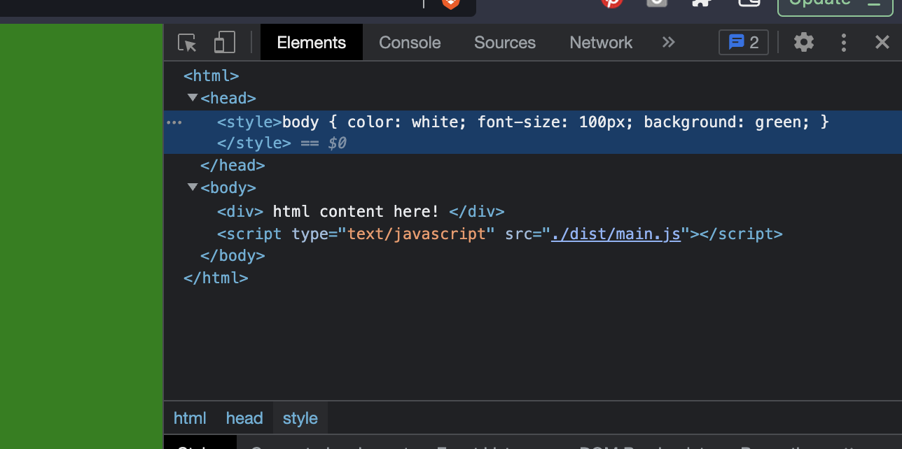

# steps

## start project

add `node_modules` to `.gitignore`

create project & install webpack

```sh
npm init -y
npm install -d webpack-cli 
```

execute webpack, create src/index.js and index.html

```sh
./node_modules/.bin/webpack
```

(error because no src is found)

```sh
mkdir src
touch src/index.js
```

edit index.js

```js
function main() {
	console.log('main');
}

main();
```

## first execution of webpack

execute webpack

```sh
./node_modules/.bin/webpack
```

look at `./dist/main.js`

```js
console.log("main");
```

(code is minified)

add `/dist` to `.gitignore`, add `script` to `package.json`

```sh
npm run build
```

## add index.html and local server

add an index.html

```sh
touch ./index.html
```

edit index.html

```html
<html>
<head>
</head>
<body>
	<script type="text/javascript" src="./dist/main.js"></script>
</body>
</html>
```

start a local server

```sh
python -m SimpleHTTPServer
```

open [http://0.0.0.0:8000](http://0.0.0.0:8000) and open the development console


examine the network activity and console output

## add more js modules

```sh
touch src/module1.js
```

```js
// src/module1.js
export function greet(name) {
	console.log(`Hello ${name}!`);
}
```

```js
// src/index.js
import { greet } from './module1.js';

function main() {
	console.log('main');
}

main();
```

```sh
npm run build
```

look at `./dist/main.js`

```js
(()=>{"use strict";console.log("main")})();
```

🤔 because of webpack dead code elimination


```js
// src/index.js
import { greet } from './module1.js';

function main() {
	console.log('main');
	greet('javi');
}

main();
```

look at `./dist/main.js`

```js
(()=>{"use strict";console.log("main"),console.log("Hello javi!")})();
```

```js
// src/index.js
import { greet } from './module1.js';

function main() {
	console.log('main');
	greet('javi');
	greet('carlos');
}

main();
```

look at `./dist/main.js`

```js
(()=>{"use strict";function o(o){console.log(`Hello ${o}!`)}console.log("main"),o("javi"),o("carlos")})();
```

## add style

edit index.html

```html
<html>
<head>
	<link rel="stylesheet" type="text/css" href="./src/style.css">
</head>
<body>
	<div>
		html content here!
	</div>
	<script type="text/javascript" src="./dist/main.js"></script>
</body>
</html>
```

```css
body {
	color:  white;
	font-size: 100px;
	background: green;
}
```

## include style from javascript

edit index.html

```html
<html>
<head>
</head>
<body>
	<div>
		html content here!
	</div>
	<script type="text/javascript" src="./dist/main.js"></script>
</body>
</html>
```

edit `./src/index.js`

```js
import { greet } from './module1.js';

import './style.css';

function main() {
	console.log('main');
	greet('javi');
	greet('carlos');
}

main();
```

```sh
npm run build
```

❌ error


install webpack loaders and configure webpack

```sh
npm install -d css-loader style-loader
```

edit `webpack.config.js`

```js
module.exports = {
	module: {
		rules: [
		{ test: /\.css$/, use: ['style-loader','css-loader'] },
		]
	},
	mode: 'development',
}
```

```sh
npm install -d css-loader style-loader
npm run build
```

webpack adds some javascript code to inject the styles in the DOM after the HTML & JS code has been loaded and parsed
(see main.js ./node_modules/style-loader/dist/runtime/injectStylesIntoStyleTag.js)


